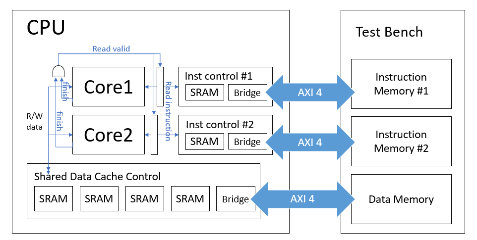

# Customized 16 bits ISA Processor

## Table of Contents  
1. [Top Level Block Diagram](#top)    
2. [About The Project](#about)  

## Top Level Block Diagram <a name="top"></a>



## About The Project <a name="about"></a>
This project developed a two-core processor with L1 cache controller.
Each processor executes 1 instructions in 6 clocks, becasue I did not develope pipeline controller in this project. I only use L1 cache in this project. The write policy of the L1 cache is write-back + write-allocate (WBWA). The replacement policy of the L1 cache is the least-recently-used (LRU) policy. 

Please refer to **Customized ISA Processor.pdf** for detailed descriptions about the instruction set, microarchitecture, FSM of cache controller, and implementation of LRU algorithm.

### Some important files in Directory structure
```bash
+---00_TESTBED
+---01_RTL
|   |---TESTBED.sv
|   |---CPU.sv
|   |---DATA_CONTROLLER.sv 
|   |---DATA_BRIDGE.v       
|   |---INST_CONTROLLER.v
|   \---INST_BRIDGE.v
+---02_SYN
|   |---syn.tcl
+---03_GATE
+---04_MEM
+---05_APR
+---06_POST
\---iclab134_final
```


